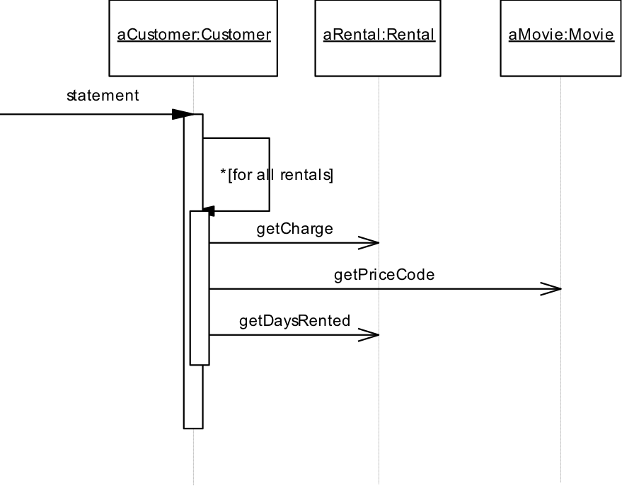
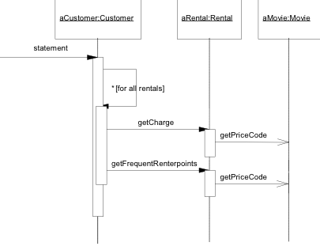
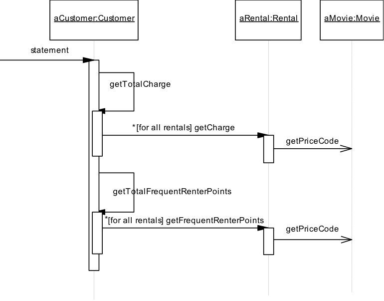

Exercise Refactoring: Videostore
================================
Resources
-------------
The following resources are convenient during the exercise:
*  Sheets Refactoring
* Need more practical background and do you have a PluralSight account? As a HAN-OOSE student you can apply for an account by mailing @rodmidde:
	* http://www.pluralsight.com/courses/refactoring-fundamentals
	* http://www.pluralsight.com/courses/writing-clean-code-humans

In this exercise you'll learn:
------------------------------
* how to apply several Refactoring steps to remove bad smells

Introduction
------------
Doel van deze oefening is het opdoen van praktijkervaring met het refactoren van bestaande code en het identificeren van “bad smells”. Bestudeer onderstaand fragment uit “Refactoring: a first Example”. In de startcode die je vindt in deze repository, zijn refactorings 1 t/m 4 reeds uitgevoerd. Creeer een nieuw Maven Java project en neem de startcode op in dit project. Voer de overige refactorings (5 t/m 13) zelf uit in de exercises 1 t/m 4. Gebruik je Java IDE voor de genoemde refactorings mits deze ondersteund worden.

REFACTORING, A FIRST EXAMPLE
----------------------------
The sample program is a program to calculate and print a statement of a customer’s charges at a video store. The program is told which movies a customer rented and for how long. It then calculates the charges, which depend on how long the movie is rented and the category of the movie. There are three kinds of movies: regular, children’s and new releases. In addition to calculating charges, the statement also computes frequent renter points, which vary depending on whether the film is a new release. Below you'll find the class diagram  of the starting point classes. Only most important features are shown.


The class Movie:
```java
public class Movie {
	public static final int CHILDREN=2;
	public static final int REGULAR=0;
	public static final int NEW_RELEASE=1;

	private String _title;
	private int _priceCode;

	public Movie(String title, int priceCode) {
		_title=title;
		_priceCode = priceCode;
	}
	public int getPriceCode() {
		return _priceCode;
	}
	public void setPriceCode(int arg) {
		_priceCode = arg;
	}
	public String getTitle() {
		return _title;
	}
}
```

The class Rental:

```java
public class Rental {
	private Movie _movie;
	private int _daysRented;

	public Rental(Movie movie, int daysRented) {
		_movie = movie;
		_daysRented = daysRented ;
	}
	public int getDaysRented() {
		return _daysRented ;
	}
	public Movie getMovie() {
		return _movie;
	}
}
```

```java
The class Customer:

public class Customer {
	private String _name;
	private Vector _rentals =new Vector();

	public Customer(String name) {
		_name = name;
	}
	public void addRental(Rental arg) {
		_rentals.addElement(arg);
	}
	public String getName() {
		return _name;
	}
	public String statement() {
		double totalAmount = 0;
		int frequentRenterPoints = 0;
		Enumeration rentals = _rentals.elements();
		String result = “Rental Record for “ + getName() + “\n”;
		while (rentals.hasMoreElements()) {
			double thisAmount = 0;
			Rental each = (Rental) rentals.nextElement();

			// determine amounts for each line
			switch (each.getMovie().getPriceCode()) {
				case Movie.REGULAR:
					thisAmount += 2;
					if (each.getDaysRented() > 2)
					   thisAmount+=(each.getDaysRented()-2)*1.5;
					break;  
				case Movie.NEW_RELEASE:
					thisAmount += each.getDaysRented() * 3;
					break;
  				case Movie.CHILDREN:
					thisAmount += 1.5;
					if (each.getDaysRented() > 3)
					   thisAmount+=(each.getDaysRented()-3)*1.5;
					break;
			}
			// add frequent renter points
			frequentRenterPoints ++;
			// add bonus for a two day new release rental
			if ((each.getMovie().getPriceCode()== Movie.NEW_RELEASE)&&
			    each.getDaysRented() > 1) frequentRenterPoints++;
			//show figures for this rental
			result += “\t” + each.getMovie().getTitle()+ “\t” +
				String.valueOf(thisAmount) + “\n”;
			totalAmount += thisAmount;
		}

// add footer lines
		result += “Amount owed is “+String.valueOf(totalAmount) + “\n”;
		result += “You earned “+String.valueOf(frequentRenterPoints)
			       + “ frequent renter points\n”;
		return result;
	}
}
```

Sequence diagram for the statement method:


There will be some changes to the program:
* Add a htmlStatment method which returns a customer statement string containing html tags.
* Moreover there will be some changes to the way movies are classified. This will affect frequent renter points and charging.

Before extending the functionality of the program we will apply some refactorings to make changes easier.

The following steps are already applied to the current source code. Read though this process and start with exercise 1 later in this document.

Preparation
-----------
1. Refactoring 1: The method statement is overly long, apply the Extract Method refactoring on ‘amounts for each line’.

The class Customer after applying this refactoring:

```java
public class Customer {
	public String statement() {
    double totalAmount = 0;
		int frequentRenterPoints = 0;
		Enumeration rentals = _rentals.elements();
		String result = “Rental Record for “ + getName() +  “\n”;
		while (rentals.hasMoreElements()) {
			double thisAmount = 0;
			Rental each = (Rental) rentals.nextElement();
			thisAmount = amountFor(each);
			// add frequent renter points
			frequentRenterPoints ++;
			// add bonus for a two day new release rental
			if ((each.getMovie().getPriceCode()== Movie.NEW_RELEASE)&&
			    each.getDaysRented() > 1) frequentRenterPoints++;
			//show figures for this rental
			result += “\t” + each.getMovie().getTitle()+ “\t” +
				String.valueOf(thisAmount) + “\n”;
			totalAmount += thisAmount;
		}
		// add footer lines
		result += “Amount owed is “+String.valueOf(totalAmount) + “\n”;
		result += “You earned “+String.valueOf(frequentRenterPoints)
			       + “ frequent renter points\n”;
		return result;
	}
	public double amountFor(Rental each) {
		double thisAmount = 0;
		switch (each.getMovie().getPriceCode()) {
			case Movie.REGULAR:
				thisAmount += 2;
				if (each.getDaysRented() > 2)
				   thisAmount+=(each.getDaysRented()-2) * 1.5;
				break;  
			case Movie.NEW_RELEASE:
				thisAmount += each.getDaysRented() * 3;
				break;
  			case Movie.CHILDREN:
				thisAmount += 1.5;
				if (each.getDaysRented() > 3)
				   thisAmount+=(each.getDaysRented()-3) * 1.5;
				break;
		}
		return thisAmount;
	}
}
```

2.Refactoring 2: Variable names not helpful, rename variables.

The new version of the method amountFor:

```java
public double amountFor(Rental aRental) {
	double result = 0;
	switch (aRental.getMovie().getPriceCode()) {
		case Movie.REGULAR:
			result += 2;
			if (aRental.getDaysRented() > 2)
			   result +=(aRental.getDaysRented()-2) * 1.5;
			break;  
		case Movie.NEW_RELEASE:
			result += aRental.getDaysRented() * 3;
			break;
  		case Movie.CHILDREN:
			result += 1.5;
			if (aRental.getDaysRented() > 3)
			   result +=(aRental.getDaysRented()-3) * 1.5;
			break;
	}
	return result ;
}
```

3.Refactoring 3: Method amountFor does not use info from Customer only from Rental, apply the Move Method refactoring.

This refactoring is done in two steps:
* Copy the code over to Rental, adjust it to fit in its new home. Compile and test!
* Find every reference to the old method and adjust the reference to use the new method.

 
Result:
```java
class Rental {
	………
	public double getCharge() {
		double result = 0;
		switch (getMovie().getPriceCode()) {
			case Movie.REGULAR:
				result += 2;
				if (getDaysRented() > 2)
				   result +=(getDaysRented()-2) * 1.5;
				break;  
			case Movie.NEW_RELEASE:
				result += getDaysRented() * 3;
				break;

  			case Movie.CHILDREN:
				result += 1.5;
				if (getDaysRented() > 3)
				   result +=(getDaysRented()-3) * 1.5;
				break;
		}
		return result ;
	}
}

public class Customer { …………
	public String statement() {
		double totalAmount = 0;
		int frequentRenterPoints = 0;
		Enumeration rentals = _rentals.elements();
		String result = “Rental Record for “ + getName() +  “\n”;
		while (rentals.hasMoreElements()) {
			double thisAmount = 0;
			Rental each = (Rental)_rentals.nextElement();
			thisAmount = each.getCharge();
			// add frequent renter points
			frequentRenterPoints ++;
			// add bonus for a two day new release rental
			if ((each.getMovie().getPriceCode()== Movie.NEW_RELEASE)&&
			    each.getDaysRented() > 1) frequentRenterPoints++;
			//show figures for this rental
			result += “\t” + each.getMovie().getTitle()+ “\t” +
				String.valueOf(thisAmount) + “\n”;
			totalAmount += thisAmount;
		}
		// add footer lines
		result += “Amount owed is “+String.valueOf(totalAmount) + “\n”;
		result += “You earned “+String.valueOf(frequentRenterPoints)
			       + “ frequent renter points\n”;
		return result;
	}
}
```


4.Refactoring 4:  The temp variable thisAmount is redundant, apply Replace Temp with Query.
The use of the variable thisAmount is replaced with calling the method getCharge:

```java
class Customer {
	………
	public String statement() {
		double totalAmount = 0;
		int frequentRenterPoints = 0;
		Enumeration rentals = _rentals.elements();
		String result = “Rental Record for “ + getName() +  “\n”;
		while (rentals.hasMoreElements()) {
			Rental each = (Rental) rentals.nextElement();
			// add frequent renter points
			frequentRenterPoints ++;
			// add bonus for a two day new release rental
			if ((each.getMovie().getPriceCode()== Movie.NEW_RELEASE)&&
			    each.getDaysRented() > 1) frequentRenterPoints++;
			//show figures for this rental
			result += “\t” + each.getMovie().getTitle()+ “\t” +
				String.valueOf(each.getCharge()) + “\n”;
			totalAmount += each.getCharge();
		}
		// add footer lines
		result += “Amount owed is “+String.valueOf(totalAmount) + “\n”;
		result += “You earned “+String.valueOf(frequentRenterPoints)
 					+ “ frequent renter points\n”;
		return result;
	}
}
```
Sequence diagram after moving the charge method:



Steps
-----
1. Exercise 1. Perform the following two refactorings, similar to the refactorings 1 and 3 on charges.
  * Refactoring 5:  The statement-method is still too long. Apply Extract Method on the frequent renter computation. Call the new method getFrequentRenterPoints.
  * Refactoring 6:  Apply Move Method on the method getFrequentRenterPoints.

  Class diagram after extraction and movement of the frequent renter points calculation:

  

  Sequence diagram after extraction and movement of the frequent renter points calculation:

  

2. Exercise 2. Perform the following two refactorings:
  * Refactoring 7: Apply the refactoring Replace Temp with Query. Replace temp variable totalAmount with query method getTotalCharge.
  * Refactoring 8: Apply the refactoring Replace Temp with Query. Replace temp variable frequentRenterPoints with query method getTotalFrequentRenterPoints.

  Class diagram after  extraction of the totals:

  

  Sequence diagram after extraction of the totals:

  

  Software extension: The requested method (htmlStatement) can now be added with minimal code duplication.

  ```java  
  class Customer {
  	………
  	public String htmlStatement() {
  		Enumeration rentals = _rentals.elements();
  	String result = “<H1>Rental Record for<EM> “ +
   	getName() +  “<EM></H1><P>\n”;
  		while (rentals.hasMoreElements()) {
  			Rental each = (Rental) rentals.nextElement();
  			//show figures for this rental
  			result +=  each.getMovie().getTitle()+ “: ” +
  				String.valueOf(each.getCharge()) + “<BR>\n”;
  		}
  		// add footer lines
  	result += “<P>Amount owed is<EM>
  “+String.valueOf(getTotalCharge())
                   + “</EM><P>\n”;
  	result += “You earned <EM>“+String.valueOf(getFrequentRenterPoints())+
  			“</EM> frequent renter points<P>\n”;
  		return result;
  	}
  }
  ```

  Next step is to get the program ready to change the classification of the movies in the store. This change will affect charging and frequent renter points.

3. Exercise 3. Perform refactoring 9 and 10.  
  * Refactoring 9: Apply Move Method for moving getCharge from Rental to Movie.

  This results in:

  ```java
  class Movie {
  	………
  	public double getCharge(int daysRented) {
  		double result = 0;
  		switch (getPriceCode()) {
  			case REGULAR:
  				result += 2;
  				if (daysRented > 2)
  				   result +=(daysRented-2) * 1.5;
  				break;  
  			case NEW_RELEASE:
  				result += daysRented * 3;
  				break;
    			case CHILDREN:
  				result += 1.5;
  				if (daysRented > 3)
  				   result +=(daysRented-3) * 1.5;
  				break;
  		}
  		return result ;
  	}
  }

   
  class Rental {
  	………
  	public double getCharge() {
  		return _movie.getCharge(_daysRented);
  	}
  }
  ```

  Note that indirection is used in the getCharge method of the class Rental.

  * Refactoring 10: Apply Move Method for moving getFrequentRenterPoints from Rental to Movie.

  This results in:

  ```java
  class Movie {
  	………
  	public int getFrequentRenterPoints(int daysRented) {
  		if ((getPriceCode() == Movie.NEW_RELEASE) && daysRented > 1)
  			return 2;
  		else
  			return 1;
  	}
  }

  class Rental {
  	public int getFrequentRenterPoints() {
  		return _movie.getFrequentRenterPoints(_daysRented);
  	}
  }
  ```

  Class diagram after moving methods to Movie:

  

  There are several types of movies that have different ways of answering the same question. This sounds like a job for subclasses. We can have three subclasses of Movie, each of which can have its own version of getCharge.  Now the switch statement can be replaced by using polymorphism. There is one problem. A movie can change its classification during lifetime. An object cannot change its class during its lifetime. There is a solution, the State pattern, as we see in exercise 4.

4.Exercise 4.
  * Perform refactoring 11. Refactoring 11: Move the type code behavior into the state pattern with Replace Type Code with State/Strategy.

  This refactoring will be performed in two steps. After the first step we created the class Price and its subclasses, but still use the price code field in the class Movie

  ```java
  class Movie {
  	………
  	public Movie(String name, int priceCode) {
  		_name = name;
  		setPriceCode(priceCode);
  	}
  	public int getPriceCode() {
  		return _priceCode;
  	}
  	public void setPriceCode(int arg) {
  		_priceCode = arg;
  	}
  	private int _priceCode;
  }

  abstract class Price {
  	abstract int getPriceCode();
  }

  class ChildrenPrice extends Price {
  	int getPriceCode(){
  		return Movie.CHILDREN;
  	}
  }
  class NewReleasePrice extends Price {
  	int getPriceCode(){
  		return Movie.NEW_RELEASE;
  	}
  }
  class RegularPrice extends Price {
  	int getPriceCode(){
  		return Movie.REGULAR;
  	}
  }
  ```

  Then we replace the price code with a price field and change the accessors (getPriceCode and setPriceCode):

  ```java
  class Movie {
  	………
  	public int getPriceCode() {
  		return _price.getPriceCode();
  	}
  	public void setPriceCode(int arg) {
  		switch (arg) {
  			case REGULAR:
  				_price = new RegularPrice();
  				break;
  			case CHILDREN:
  				_price = new ChildrenPrice();
  				break;
  			case NEW_RELEASE:
  				_price = new NewReleasePrice();
  				break;
  			default:
  	throw new IllegalArgumentException
  						(“Incorrect Price Code”);
  		}
  	}
  	private Price _price;
  }
  ```

5.Exercise 5.Perform the following two refactorings:
  * Refactoring 12: Apply the refactoring Move Method to move the switch statement of the method getCharge to the Price class.
  * Refactoring 13: Apply the refactoring Replace Conditional with Polymorphism to eliminate this switch statement.

6.Exercise 6. Follow the same procedure for frequent renter points.


Done
----
You can checkout the branch exercise-results for a working project and review possible differences.
